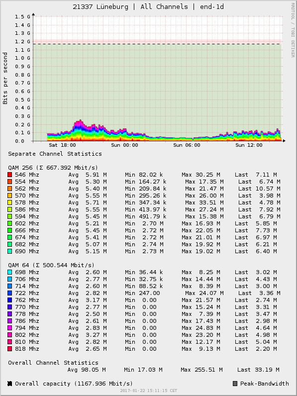

# docsis-stats
Some scripts to measure current utilization of DOCSIS downstream channels



These scripts are heavily inspired by the collective work of some people at the
"Inoffizielles Vodafone-Kabel-Forum"

https://www.kdgforum.de/viewtopic.php?f=69&t=15097

The RRD is tuned to collect new data points every 10 minutes. To start
measure, attach a DVB-C compatible USB-Stick to your linux box and initialize
the database files with

```
./create-rrds.sh
```

Start collecting data by adding the following line to your crontab:

```
*/10 * * * * /path/to/file/freq_collect.sh
```

You can generate the graph by executing the final script:

```
./gen-graphs.sh
```
